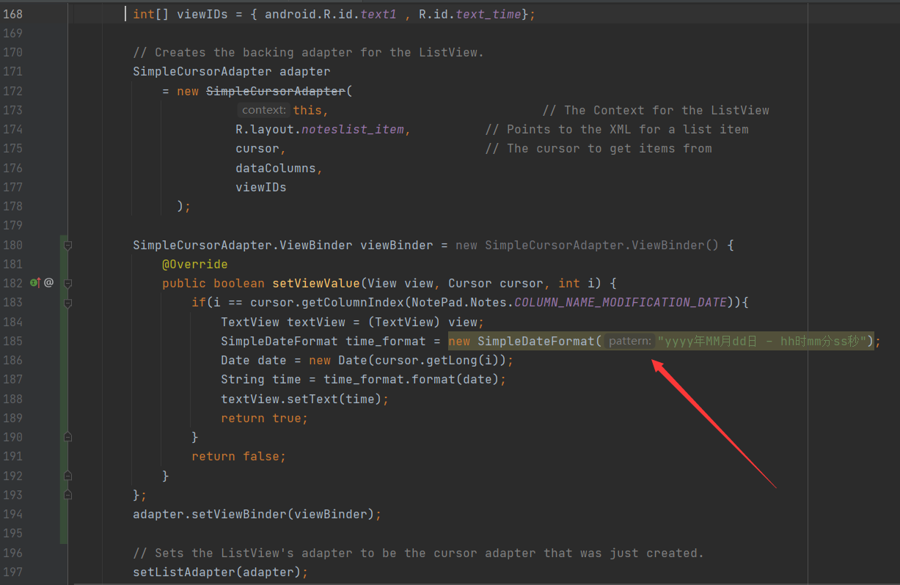
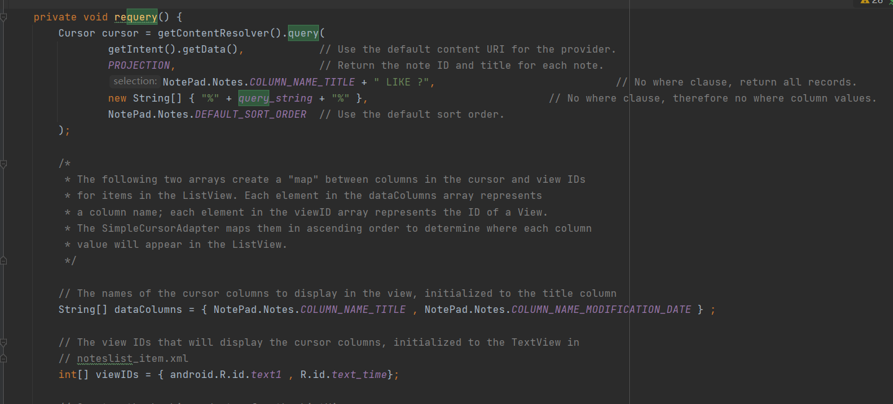
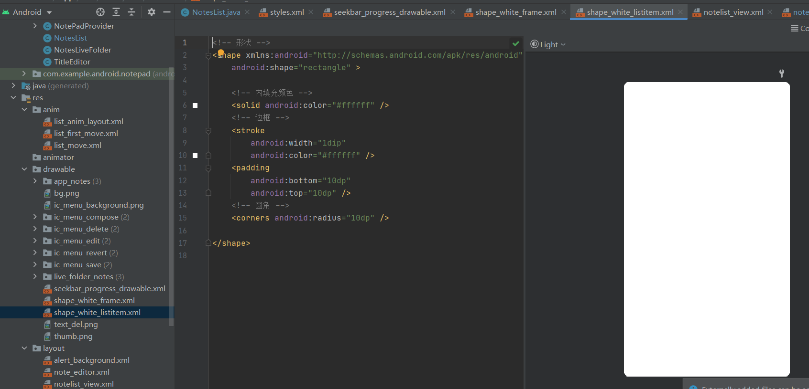

### 主要功能1：增加日期显示

#### 效果图：

#### 实现方法：

修改布局文件，预留时间显示空间

在 SimpleCursorAdapter 的显示条目中增加日期栏

并在 SimpleCursorAdapter 实现前对其进行 viewBinder 的绑定，使便签项中显示的时间格式化

------

### 主要功能2：增加搜索显示（动态演示见附加功能）

#### 效果图：

##### 搜索前

##### 搜索后

#### 实现方法：

修改主视图，创建搜索框

监听搜索框内容变化时修改 query_string 并触发数据库检索，同时根据框中内容决定是否显示清空按钮

根据 query_string 进行模糊查询并刷新页面

------

### 附加功能1：UI美化

#### 效果图：

#### 实现方法：

修改 styles.xml ，修改主题颜色（Action Bar颜色）

在 drawable 文件夹下创建新 shape ，作为便签项的背景

将 shape 应用于背景，并设置标签项阴影、间距等属性完成简单界面美化

------

### 附加功能2：添加动画效果

#### 进入app动画效果：

#### 搜索动画效果：

#### 实现方法：

博客链接：https://blog.csdn.net/qq_40517035/article/details/121473836

首先我们在 res 文件夹下新建 anim 文件夹，并在 anim 文件夹中新建 list_anim_layout.xml 文件作为我们的主动画文件。在 list_anim_layout.xml 文件中写入下图代码

然后在 anim 文件夹中新建 list_first_move.xml 文件作为我们的具体动画文件，写入代码

最后在布局文件中找到我们要设置动画的对象，然后设置其 android:layoutAnimation 属性为刚才设置的主动画文件即可

------

### 附加功能3：背景颜色修改

#### 效果图：

#### 实现方法：

创建弹窗布局文件，包含 seekbar

修改菜单文件，增加背景修改图标

设置单击图标触发弹窗事件

对每个进度条设置拖动事件

数据存储使用 SharedPreference

------

报告结束，感谢收看:)

